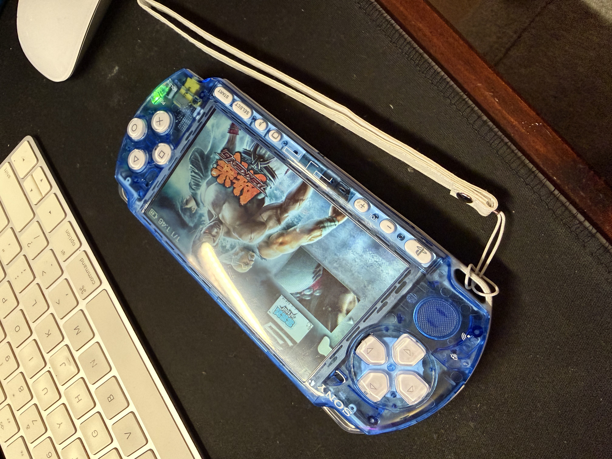

# PSP 3000 — Modding Guide with ARK-4

A comprehensive step-by-step guide to modding a PSP 3000 using the **ARK-4** custom firmware.

This guide is based on the method demonstrated in [this video tutorial](https://www.youtube.com/watch?v=zKD__94GxWQ).



## Overview

| Detail           | Value              |
| ---------------- | ------------------ |
| Console          | PSP 3000           |
| Official FW      | 6.61               |
| Custom Firmware  | ARK-4              |
| Status           | Fully operational  |

## Table of Contents

1. [Prerequisites](#1-prerequisites) — Required hardware and software
2. [Firmware Update](#2-firmware-update) — Upgrading to 6.60/6.61 (if needed)
3. [ARK-4 Installation](#3-ark-4-installation) — Temporary, cIPL, and Full Flash installation
4. [Reverting & Uninstalling](#4-reverting--uninstalling-ark-4) — Reverting cIPL and removing ARK-4
5. [Configuration](#5-configuration) — Post-installation settings
6. [Plugins](#6-plugins) — Installed plugins and their configuration
7. [Homebrews and Emulators](#7-homebrews-and-emulators) — Homebrew applications
8. [Troubleshooting](#8-troubleshooting) — Common issues and solutions
9. [Hardware Modification](#9-hardware-modification--shell-swap) — Shell swap and physical customisation

## What is ARK-4?

[ARK-4](https://github.com/PSP-Archive/ARK-4) is an open-source custom firmware for the PlayStation Portable. It enables the following capabilities:

- Running homebrew applications and emulators
- Installing system plugins
- Customising the XMB interface (themes, icons)
- Loading game backups in ISO/CSO format

ARK-4 is actively maintained and supports all PSP models (1000, 2000, 3000, Go, and Street).

## Included Files

All files required for the modding process are included in the [`ARK4/`](ARK4/) directory:

| Resource | Location |
| -------- | -------- |
| ARK-4 custom firmware | [`ARK4/`](ARK4/) |
| ARK Loader | [`ARK4/ARK_Loader/`](ARK4/ARK_Loader/) |
| ARK savedata | [`ARK4/ARK_01234/`](ARK4/ARK_01234/) |
| cIPL Flasher | [`ARK4/PSP/ARK_cIPL/`](ARK4/PSP/ARK_cIPL/) |
| Firmware update (6.61) | [`ARK4/UPDATE/`](ARK4/UPDATE/) |
| Themes | [`ARK4/themes/`](ARK4/themes/) |
| PC utilities | [`ARK4/PC/`](ARK4/PC/) |

## Useful Links

| Resource | Link |
| -------- | ---- |
| Video tutorial | [YouTube](https://www.youtube.com/watch?v=zKD__94GxWQ) |
| ARK-4 GitHub repository | [PSP-Archive/ARK-4](https://github.com/PSP-Archive/ARK-4) |

## Hardware Used

| Item | Link |
| ---- | ---- |
| Micro SD to Memory Stick Pro Duo adapter | [Amazon](https://amzn.to/439xPEv) |
| Micro SD card | [Amazon](https://amzn.to/44rR8v8) |
| Custom transparent blue replacement shell with buttons | AliExpress |

---

## 1. Prerequisites

### Required Hardware

- **PSP 3000** with battery charged to at least 80%
- **Micro SD to Memory Stick Pro Duo adapter** ([Amazon](https://amzn.to/439xPEv))
- **Micro SD card** ([Amazon](https://amzn.to/44rR8v8))
- **USB cable** to connect the PSP to a computer (or a memory card reader)
- **Computer** (Windows, macOS, or Linux)
- **PSP charger** — must remain connected throughout the entire procedure

### Required Software

All required files are already included in this repository:

| File | Description | Location |
| ---- | ----------- | -------- |
| Firmware 6.60 or 6.61 | Official Sony firmware (only if the PSP is below 6.60) | [`ARK4/UPDATE/`](ARK4/UPDATE/) |
| ARK-4 | Custom firmware | [`ARK4/`](ARK4/) |

### Checking the Current Firmware Version

1. Power on the PSP
2. Navigate to **Settings** > **System Settings** > **System Information**
3. The firmware version will be displayed

- **6.60 or 6.61**: Proceed directly to [ARK-4 Installation](#3-ark-4-installation)
- **Below 6.60**: Complete the [Firmware Update](#2-firmware-update) first

### Recommendations Before Starting

- **Back up** all important data from the memory card
- **Charge** the battery to at least 80% and keep the charger connected
- **Do not power off** the PSP during any installation step
- **Read** this guide in its entirety before beginning

---

## 2. Firmware Update

> **Note:** This step is only required if the PSP is running a firmware version below 6.60. If the PSP is already on 6.60 or 6.61, proceed directly to [ARK-4 Installation](#3-ark-4-installation).

### Locating the Firmware

The firmware update file is already included in this repository at [`ARK4/UPDATE/`](ARK4/UPDATE/).

### Installation Procedure

#### Preparing the Memory Card

1. Connect the PSP to the computer via USB
2. Create the following directory structure on the memory card:

```
ms0:/PSP/GAME/UPDATE/
```

3. **Copy** the `EBOOT.PBP` file from [`ARK4/UPDATE/`](ARK4/UPDATE/) into the `UPDATE` directory on the memory card:

```
ms0:/PSP/GAME/UPDATE/EBOOT.PBP
```

5. Disconnect the USB cable

#### Running the Update

1. Ensure the battery is at **80% or above** and that the **charger is connected**
2. On the PSP, navigate to **Game** > **Memory Stick**
3. An update icon will appear
4. Launch the application and follow the on-screen instructions
5. **Do not power off the PSP** during the update process
6. The PSP will restart automatically upon completion

#### Verification

Navigate to **Settings** > **System Settings** > **System Information** to confirm that the firmware version now reads 6.60 or 6.61.

---

## 3. ARK-4 Installation

This guide covers three installation methods: temporary, permanent (cIPL), and full flash. Start with the temporary installation, then optionally proceed to cIPL and/or full flash.

### Temporary Installation

1. All ARK-4 files are already included in this repository at [`ARK4/`](ARK4/).
2. Plug your PSP into a computer. This will automatically enable USB Mode and mount the console's memory card to the computer. You can also plug the memory card directly into a computer if you have a Memory Stick compatible card reader.
   - If the console's USB mode doesn't automatically activate, it can be manually activated in the XMB settings.
3. Copy the contents from the [`ARK4/`](ARK4/) folder to the memory card:
   - Copy the [`ARK_01234/`](ARK4/ARK_01234/) folder to `PSP/SAVEDATA/` on the PSP's memory card or PSP Go's internal storage.
   - Copy the [`ARK_Loader/`](ARK4/ARK_Loader/) folder to `PSP/GAME/` on the console's memory card.
     - You can also copy the [`ARK_Full_Installer/`](ARK4/PSP/ARK_Full_Installer/) and [`ARK_cIPL/`](ARK4/PSP/ARK_cIPL/) folders to the same `PSP/GAME/` folder to do a full flash or installation of permanent CFW respectively.
4. Exit USB mode after transferring the files over. View your games list and there should be a new listing for the ARK Loader, alongside its respective save file in the save data management.
5. To install custom firmware, select the **ARK Loader** application and launch it.
6. Once the PSP restarts, check in **Settings** > **System Settings** > **System Information** and confirm you see the system software version along with the custom firmware version after it.
7. Your PSP is now running temporary custom firmware. If you would like to install it permanently, continue to the section below for cIPL installation.

### Installing CFW with cIPL (Optional, recommended)

This is the preferred method of installing CFW, as it can run during bootup and can give you brick protection.

1. All ARK-4 files are already included in this repository at [`ARK4/`](ARK4/).
2. Plug your PSP into a computer. This will automatically enable USB Mode and mount the console's memory card to the computer. You can also plug the memory card directly into a computer if you have a Memory Stick compatible card reader.
   - If the console's USB mode doesn't automatically activate, it can be manually activated in the XMB settings.
3. Copy the [`ARK_cIPL/`](ARK4/PSP/ARK_cIPL/) folder into `PSP/GAME/` on the memory card if you haven't done so already.
4. Launch the **ARK cIPL installer** application, and select the option for **New cIPL**.
5. Your PSP will now have cIPL ARK-4 CFW. It can be seen in the system settings.

> **Caution:** Flashing the IPL carries a small but non-zero risk of bricking the PSP if the process is interrupted. Ensure the battery is adequately charged and the charger is connected before proceeding.

### Full Flash Installation (Optional, recommended)

Normally, many functions of ARK-4 are kept in the `ARK_01234` save data folder, such as the CFW settings or custom launcher. If this is undesirable for you, you can install these functions to the PSP's internal flash memory so ARK-4's save data file is no longer necessary. That being said, the `ARK_01234` save file folder will still be prioritised for CFW settings if it's detected on the memory stick. It will also be re-created if you run an ARK-4 update from an OTA update or sideloading the ARK_Updater application.

Since the PSP's flash memory is also too small (except on the PSP Go) to store the custom launcher that comes with ARK-4's save data folder, PRO Shell will instead be used as the custom launcher with a separate and more basic recovery menu if the save data folder is not detected.

> **Note:** If you are using ARK-4 on a PSP Go, then the full flash installation can be skipped entirely, as you can just use the `ARK_01234` save file in the 16 GB internal memory.

1. All ARK-4 files are already included in this repository at [`ARK4/`](ARK4/).
2. Plug your PSP into a computer. This will automatically enable USB Mode and mount the console's memory card to the computer. You can also plug the memory card directly into a computer if you have a Memory Stick compatible card reader.
   - If the console's USB mode doesn't automatically activate, it can be manually activated in the XMB settings.
3. Copy the [`ARK_Full_Installer/`](ARK4/PSP/ARK_Full_Installer/) folder into `PSP/GAME/` on the memory card.
4. Launch the application and follow the on-screen instructions.
5. Your PSP will now have ARK-4 fully installed on the console's internal flash memory, allowing the reliance on having an ARK-4 save file to be no longer necessary for operation.

### Verification

Go to **Settings** > **System Settings** > **System Information**. System Software should display **6.61 ARK-4**.

### Post-Jailbreak Tips

- **Installing Games:** Connect to PC and create a folder named `ISO` in the root of the Memory Stick. Place your `.ISO` or `.CSO` game files there.
- **Accessing the VSH Menu:** Press the **SELECT** button on the home screen to access the VSH menu and customise settings.

---

## 4. Reverting & Uninstalling ARK-4

### Reverting cIPL to Temporary Mode

To remove the permanent installation and revert to temporary mode:

1. Launch the **ARK cIPL Flasher** again
2. Select the option to uninstall/restore the original IPL
3. The PSP will return to official firmware on the next reboot

Alternatively, reinstalling the official 6.61 firmware via the update method described in [Firmware Update](#2-firmware-update) will also remove the cIPL.

### Uninstalling ARK-4

To fully remove ARK-4 from the PSP and restore stock firmware:

1. Delete the ARK-4 directories from the memory card (`ARK_01234`, `ARK_Loader`, `ARK_cIPL`, `ARK_Full_Installer`)
2. Delete the `SEPLUGINS` directory
3. If cIPL was installed: reinstall the official 6.61 firmware
4. The PSP will be running stock firmware

---

## 5. Configuration

### ARK-4 Recovery Menu

The Recovery menu provides access to advanced ARK-4 settings.

**Access:** Hold **R** during boot.

#### Key Options

| Option              | Description                                         |
| ------------------- | --------------------------------------------------- |
| Toggle USB          | Enable or disable USB access from Recovery          |
| Toggle Plugins      | Enable or disable installed plugins                 |
| CPU Speed           | Adjust the processor clock speed (222/333 MHz)      |
| XMB Settings        | Customise XMB behaviour                             |
| Advanced Settings   | Advanced CFW parameters                             |

### CPU Clock Speed

- **222 MHz**: Default speed; conserves battery life and is sufficient for most PSP games
- **333 MHz**: Maximum performance; recommended for emulators and demanding homebrew applications

This setting is accessible via **Recovery** > **CPU Speed**.

### SEPLUGINS Directory

The `ms0:/SEPLUGINS/` directory contains plugin configuration files:

| File         | Execution Context                                     |
| ------------ | ----------------------------------------------------- |
| `game.txt`   | Plugins loaded during PSP game execution              |
| `vsh.txt`    | Plugins loaded in the XMB (Visual Shell)              |
| `pops.txt`   | Plugins loaded during PS1 game execution              |

Each file uses the following format — one plugin per line, followed by `1` (enabled) or `0` (disabled):

```
ms0:/SEPLUGINS/plugin_name.prx 1
ms0:/SEPLUGINS/another_plugin.prx 0
```

### Recommended Settings

- **USB Charging**: Enable in System Settings to allow charging via USB
- **Auto Sleep**: Consider disabling during extended emulation sessions

---

## 6. Plugins

> **To be completed** — this section will be updated as plugins are installed.

### Installed Plugins

| Plugin | File | Context | Description |
| ------ | ---- | ------- | ----------- |
| *To be added* | | | |

### How to Install a Plugin

1. Download the `.prx` plugin file
2. Copy it to `ms0:/SEPLUGINS/`
3. Edit the appropriate configuration file (`vsh.txt`, `game.txt`, or `pops.txt`)
4. Add the following line: `ms0:/SEPLUGINS/plugin_name.prx 1`
5. Restart the PSP

### Notable Plugins for PSP

| Plugin          | Description                                       |
| --------------- | ------------------------------------------------- |
| CXMB            | Custom XMB themes                                 |
| Categories Lite | Organise games and homebrew into folders           |
| Game Categories | Alternative to Categories Lite                    |
| PSPStates       | Save states for PSP games                         |
| Dayviewer       | Display date and calendar on the XMB              |

---

## 7. Homebrews and Emulators

> **To be completed** — this section will be updated as homebrews are installed.

### Installed Homebrews

| Homebrew | Description | Link |
| -------- | ----------- | ---- |
| *To be added* | | |

### Emulators

| Emulator | Emulated Systems | Link |
| -------- | ---------------- | ---- |
| *To be added* | | |

### How to Install a Homebrew

1. Download the homebrew (typically a directory containing an `EBOOT.PBP` file)
2. Copy the entire directory to `ms0:/PSP/GAME/`
3. The homebrew will appear under **Game** > **Memory Stick** on the XMB

```
ms0:/PSP/GAME/
└── homebrew_name/
    ├── EBOOT.PBP
    └── ... (additional files)
```

### Loading Game Backups (ISO/CSO)

1. Create the directory `ms0:/ISO/` if it does not already exist
2. Copy `.iso` or `.cso` files into this directory
3. The games will appear under **Game** > **Memory Stick** on the XMB

> **Note:** CSO files are compressed ISOs, useful for conserving space on the memory card.

### PSP Game Library

PSP games in ISO format can be found online — find your own source.

---

## 8. Troubleshooting

### The PSP Does Not Boot / Black Screen

1. Hold the **Power** button for 10 seconds to force a shutdown
2. Remove the battery, wait 10 seconds, then reinsert it
3. Boot while holding **R** to access the Recovery menu
4. In Recovery, disable all plugins and restart

### ARK-4 Fails to Launch

- Verify that the files have been copied to the correct locations on the memory card
- Confirm that the firmware version is 6.60 or 6.61
- Re-download ARK-4 and repeat the file transfer

### A Plugin Causes a Crash

1. Boot while holding **R** to access the Recovery menu
2. Navigate to **Plugins** and disable the offending plugin
3. Restart the PSP
4. Remove the plugin file (`.prx`) and its corresponding entry in the configuration file

### ISO Games Do Not Appear

- Verify that the files are located in `ms0:/ISO/`
- Confirm the file extension is `.iso` or `.cso`
- Restart the PSP

### Error "The game could not be started" (80010087)

- The ISO file may be corrupted — re-download or re-dump it
- Attempt converting to CSO and then back to ISO

### Memory Card Not Detected

- Clean the contacts on the memory card and the PSP's card slot
- If using a micro SD adapter, ensure the SD card is properly seated
- Test with a different memory card if available

### Full Reset

To restore the PSP to its original, unmodified state, refer to [Uninstalling ARK-4](#uninstalling-ark-4).

---

## 9. Hardware Modification — Shell Swap

In addition to the software modification, the PSP underwent a complete physical shell replacement.

### Overview

The original PSP 3000 shell was replaced with a custom transparent blue shell sourced from AliExpress. The entire electronic assembly was disassembled from the original chassis and reassembled into the new one. The transparent shell allows the internal components to be visible through the housing.


### Parts Used

| Part | Source | Description |
| ---- | ------ | ----------- |
| Custom transparent blue shell | AliExpress | Full transparent replacement housing with custom buttons |

### Procedure

1. **Full disassembly** of the original PSP 3000 — removal of all internal electronics
2. **Transfer** of the complete electronic assembly (motherboard, screen, battery connector, speakers, Wi-Fi antenna, etc.) into the new blue shell
3. **Reassembly** with the replacement buttons included with the new housing
4. **Testing** of all hardware functions (buttons, screen, UMD drive, audio, Wi-Fi, USB)

### Notes

- The replacement shell includes custom-coloured buttons, giving the PSP a distinct appearance
- Care must be taken with the ribbon cables (screen, buttons, Wi-Fi) during disassembly and reassembly, as they are fragile
- The UMD drive and its ribbon cable require particular attention during the transfer
- No soldering is required for a standard shell swap — it is entirely a mechanical procedure

---

## Disclaimer

This guide documents a personal experience. Console modification carries inherent risks, including the possibility of bricking the device. Proceed with caution and at your own risk.
